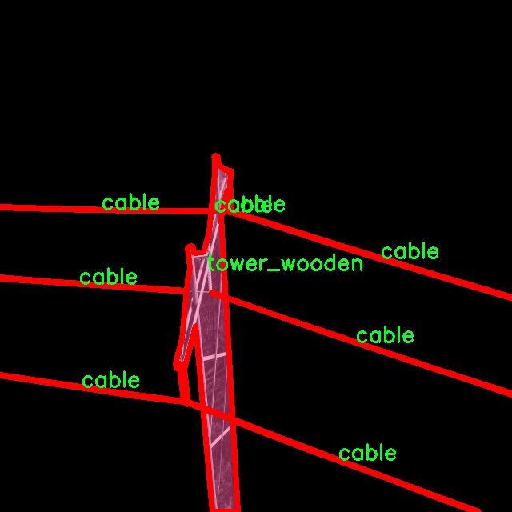

# 线路传输缺陷分割系统源码＆数据集分享
 [yolov8-seg-CSwinTransformer＆yolov8-seg-C2f-DLKA等50+全套改进创新点发刊_一键训练教程_Web前端展示]

### 1.研究背景与意义

项目参考[ILSVRC ImageNet Large Scale Visual Recognition Challenge](https://gitee.com/YOLOv8_YOLOv11_Segmentation_Studio/projects)

项目来源[AAAI Global Al lnnovation Contest](https://kdocs.cn/l/cszuIiCKVNis)

研究背景与意义

随着现代社会对电力和通信线路的依赖日益加深，线路传输的安全性和可靠性成为了亟待解决的重要问题。线路传输缺陷不仅会导致设备故障、服务中断，还可能引发严重的安全事故。因此，及时、准确地识别和分割线路传输中的缺陷，成为了电力和通信行业中不可或缺的环节。传统的缺陷检测方法多依赖人工巡检和经验判断，效率低下且容易受到人为因素的影响，难以满足现代化管理的需求。因此，基于计算机视觉和深度学习技术的自动化缺陷检测系统应运而生，成为研究的热点。

在众多深度学习模型中，YOLO（You Only Look Once）系列因其高效的实时检测能力而受到广泛关注。YOLOv8作为该系列的最新版本，具备了更强的特征提取能力和更快的推理速度，适合于处理复杂的图像分割任务。通过对YOLOv8模型的改进，结合线路传输缺陷的特征，可以构建出一个高效的缺陷分割系统。该系统不仅能够提高缺陷检测的准确性，还能在实际应用中实现实时监控，极大地提升线路维护的效率。

本研究所使用的数据集“line-transmission-ae”包含1200幅图像，涵盖了6个类别的缺陷对象。这一数据集的多样性和丰富性为模型的训练和验证提供了良好的基础。通过对这些图像进行实例分割，研究将能够有效识别出不同类型的缺陷，进而为后续的线路维护和管理提供数据支持。具体而言，数据集中每个类别的细致划分，使得模型能够在复杂环境中进行更为精准的缺陷识别，降低误检率和漏检率。

此外，随着人工智能技术的不断发展，基于深度学习的图像处理方法在各个领域的应用越来越广泛。将YOLOv8模型应用于线路传输缺陷的分割，不仅是对现有技术的延伸与创新，更是推动电力和通信行业智能化发展的重要一步。通过本研究的实施，可以为相关领域提供一种新的解决方案，促进智能监测系统的普及与应用。

综上所述，基于改进YOLOv8的线路传输缺陷分割系统的研究，不仅具有重要的理论意义，也具有广泛的实际应用价值。通过提升缺陷检测的自动化和智能化水平，能够有效降低人工成本，提高工作效率，进而保障线路传输的安全性和可靠性。这一研究将为未来的智能电网和智能通信网络的建设提供重要的技术支持和理论依据。

### 2.图片演示


##### 注意：由于此博客编辑较早，上面“2.图片演示”和“3.视频演示”展示的系统图片或者视频可能为老版本，新版本在老版本的基础上升级如下：（实际效果以升级的新版本为准）

  （1）适配了YOLOV8的“目标检测”模型和“实例分割”模型，通过加载相应的权重（.pt）文件即可自适应加载模型。

  （2）支持“图片识别”、“视频识别”、“摄像头实时识别”三种识别模式。

  （3）支持“图片识别”、“视频识别”、“摄像头实时识别”三种识别结果保存导出，解决手动导出（容易卡顿出现爆内存）存在的问题，识别完自动保存结果并导出到tempDir中。

  （4）支持Web前端系统中的标题、背景图等自定义修改，后面提供修改教程。

  另外本项目提供训练的数据集和训练教程,暂不提供权重文件（best.pt）,需要您按照教程进行训练后实现图片演示和Web前端界面演示的效果。

### 3.视频演示

[3.1 视频演示](https://www.bilibili.com/video/BV17Ny3YLEoH/)

### 4.数据集信息展示

##### 4.1 本项目数据集详细数据（类别数＆类别名）

nc: 6
names: ['cable', 'object', 'tower_lattice', 'tower_tucohy', 'tower_wooden', 'void']


##### 4.2 本项目数据集信息介绍

数据集信息展示

在现代电力和通信基础设施的维护与监测中，线路传输缺陷的及时识别与分割显得尤为重要。为此，我们构建了一个名为“line-transmission-ae”的数据集，旨在为改进YOLOv8-seg模型提供丰富的训练数据，助力于线路传输缺陷的自动化检测与分割。该数据集的设计充分考虑了线路传输系统的复杂性，涵盖了多种类别的对象，以便模型能够在实际应用中实现高效、准确的识别。

“line-transmission-ae”数据集包含六个主要类别，分别为：电缆（cable）、物体（object）、塔架（tower_lattice）、涂层塔架（tower_tucohy）、木质塔架（tower_wooden）以及空白区域（void）。这些类别的选择反映了线路传输系统中常见的元素，旨在帮助模型学习到不同对象之间的特征差异，从而提高分割的精度和鲁棒性。

电缆类别是数据集中的重要组成部分，代表了电力和通信线路的核心部分。通过对电缆的精确分割，模型能够识别出潜在的损坏或缺陷，进而为维护工作提供依据。物体类别则包括可能影响线路传输的各种外部因素，如树木、建筑物等，这些物体的存在可能会对线路的安全性产生影响，因此需要在分割过程中予以考虑。

塔架类别的细分为涂层塔架、木质塔架和金属塔架，反映了不同材料和结构的塔架在实际应用中的多样性。涂层塔架通常用于防腐蚀，而木质塔架则在某些特定环境中使用。通过对这些不同类型塔架的分割，模型可以学习到不同结构在外观上的差异，从而在实际应用中更好地适应各种环境。

空白区域类别的引入，旨在帮助模型区分有效信息与背景噪声。通过标注空白区域，模型能够更好地理解哪些区域是需要关注的目标，哪些区域则可以忽略，从而提高整体的分割效果。

整个数据集经过精心标注，确保每个类别的样本数量均衡，覆盖了多种不同的场景和光照条件。这种多样性不仅提高了模型的泛化能力，也使其在实际应用中能够适应不同的环境变化。数据集中的图像经过高质量的采集和处理，确保了清晰度和细节的丰富性，为模型的训练提供了坚实的基础。

在训练过程中，YOLOv8-seg模型将利用“line-transmission-ae”数据集中的标注信息，学习到各个类别的特征，从而实现高效的线路传输缺陷分割。通过不断的迭代与优化，模型将能够在实际应用中快速、准确地识别出线路传输中的各种缺陷，为电力和通信行业的安全运营提供有力支持。

综上所述，“line-transmission-ae”数据集不仅为YOLOv8-seg模型的训练提供了丰富的样本，也为线路传输缺陷的自动化检测奠定了基础。通过对该数据集的深入研究与应用，我们期待能够推动线路传输监测技术的发展，为行业的安全与效率提升贡献力量。





### 5.全套项目环境部署视频教程（零基础手把手教学）

[5.1 环境部署教程链接（零基础手把手教学）](https://www.bilibili.com/video/BV1jG4Ve4E9t/?vd_source=bc9aec86d164b67a7004b996143742dc)


[5.2 安装Python虚拟环境创建和依赖库安装视频教程链接（零基础手把手教学）](https://www.bilibili.com/video/BV1nA4VeYEze/?vd_source=bc9aec86d164b67a7004b996143742dc)

### 6.手把手YOLOV8-seg训练视频教程（零基础小白有手就能学会）

[6.1 手把手YOLOV8-seg训练视频教程（零基础小白有手就能学会）](https://www.bilibili.com/video/BV1cA4VeYETe/?vd_source=bc9aec86d164b67a7004b996143742dc)


按照上面的训练视频教程链接加载项目提供的数据集，运行train.py即可开始训练



     Epoch   gpu_mem       box       obj       cls    labels  img_size
     1/200     0G   0.01576   0.01955  0.007536        22      1280: 100%|██████████| 849/849 [14:42<00:00,  1.04s/it]
               Class     Images     Labels          P          R     mAP@.5 mAP@.5:.95: 100%|██████████| 213/213 [01:14<00:00,  2.87it/s]
                 all       3395      17314      0.994      0.957      0.0957      0.0843

     Epoch   gpu_mem       box       obj       cls    labels  img_size
     2/200     0G   0.01578   0.01923  0.007006        22      1280: 100%|██████████| 849/849 [14:44<00:00,  1.04s/it]
               Class     Images     Labels          P          R     mAP@.5 mAP@.5:.95: 100%|██████████| 213/213 [01:12<00:00,  2.95it/s]
                 all       3395      17314      0.996      0.956      0.0957      0.0845

     Epoch   gpu_mem       box       obj       cls    labels  img_size
     3/200     0G   0.01561    0.0191  0.006895        27      1280: 100%|██████████| 849/849 [10:56<00:00,  1.29it/s]
               Class     Images     Labels          P          R     mAP@.5 mAP@.5:.95: 100%|███████   | 187/213 [00:52<00:00,  4.04it/s]
                 all       3395      17314      0.996      0.957      0.0957      0.0845


### 7.50+种全套YOLOV8-seg创新点代码加载调参视频教程（一键加载写好的改进模型的配置文件）

[7.1 50+种全套YOLOV8-seg创新点代码加载调参视频教程（一键加载写好的改进模型的配置文件）](https://www.bilibili.com/video/BV1Hw4VePEXv/?vd_source=bc9aec86d164b67a7004b996143742dc)

### 8.YOLOV8-seg图像分割算法原理

原始YOLOv8-seg算法原理

YOLOv8-seg算法作为YOLO系列的最新进展，代表了目标检测和分割领域的一次重要突破。它不仅延续了YOLO系列一贯的高效性和准确性，还在算法架构和实现细节上进行了多项创新，特别是在处理复杂场景下的目标检测和实例分割任务中，展现出了卓越的性能。该算法的设计理念是将目标检测与图像分割任务有效结合，利用深度学习技术的优势，提供一种端到端的解决方案。

YOLOv8-seg的核心结构由三个主要部分组成：主干网络（Backbone）、特征增强网络（Neck）和检测头（Head）。在主干网络中，YOLOv8-seg采用了轻量化的C2F模块，取代了传统的C3模块。这一创新的模块设计不仅减少了计算量，还通过引入更多的残差连接，提升了特征提取的效率和准确性。C2F模块的设计灵感来源于CSPNet和ELAN模块，旨在实现更深层次的特征学习，使得网络能够在保持轻量化的同时，获取更丰富的梯度信息。这种特征提取的优化，使得YOLOv8-seg在处理多尺度目标时，能够更好地捕捉到细节信息，提升了模型的整体性能。

在特征增强网络方面，YOLOv8-seg结合了特征金字塔网络（FPN）和路径聚合网络（PAN）的优势，构建了一个高效的特征融合机制。通过BiFPN网络的引入，YOLOv8-seg实现了高效的双向跨尺度连接，能够在不同尺度的特征图之间进行加权融合。这种特征融合策略不仅提高了模型对不同尺度特征信息的提取速度，还增强了模型对复杂场景的适应能力，使得目标检测和分割的效果更加显著。

在检测头部分，YOLOv8-seg采用了解耦合头结构，将目标分类和位置回归任务分离开来。这一设计使得每个任务能够更加专注于自身的目标，进而提高了检测精度和分割效果。与传统的锚框方法不同，YOLOv8-seg引入了Anchor-free的目标检测方式，直接通过回归预测目标的位置和大小。这种方法的优势在于消除了锚框选择和调整的复杂性，使得模型能够更快速地聚焦于目标位置，进而提升了检测的效率和准确性。

YOLOv8-seg在训练过程中也采用了一系列创新的数据增强策略，以提高模型的泛化能力。通过动态的样本分配策略和特定的增强技术，YOLOv8-seg能够在训练阶段有效地提高模型对不同场景的适应性。此外，在损失计算方面，YOLOv8-seg使用了BCELoss作为分类损失，DFLLoss和CIoULoss作为回归损失，进一步提升了模型的训练效果。

总的来说，YOLOv8-seg算法在目标检测和实例分割任务中展现出了强大的能力。通过对网络结构的精心设计和优化，YOLOv8-seg不仅提高了模型的检测精度和速度，还增强了其在复杂场景下的表现。其轻量化的特性使得该模型能够在各种嵌入式设备上进行部署，满足实时检测的需求。随着YOLOv8-seg的推广和应用，未来在智能监控、自动驾驶、无人机视觉等领域，将会有更广泛的应用前景。


### 9.系统功能展示（检测对象为举例，实际内容以本项目数据集为准）

图9.1.系统支持检测结果表格显示

  图9.2.系统支持置信度和IOU阈值手动调节

  图9.3.系统支持自定义加载权重文件best.pt(需要你通过步骤5中训练获得)

  图9.4.系统支持摄像头实时识别

  图9.5.系统支持图片识别

  图9.6.系统支持视频识别

  图9.7.系统支持识别结果文件自动保存

  图9.8.系统支持Excel导出检测结果数据


### 10.50+种全套YOLOV8-seg创新点原理讲解（非科班也可以轻松写刊发刊，V11版本正在科研待更新）

#### 10.1 由于篇幅限制，每个创新点的具体原理讲解就不一一展开，具体见下列网址中的创新点对应子项目的技术原理博客网址【Blog】：


[10.1 50+种全套YOLOV8-seg创新点原理讲解链接](https://gitee.com/qunmasj/good)

#### 10.2 部分改进模块原理讲解(完整的改进原理见上图和技术博客链接)【如果此小节的图加载失败可以通过CSDN或者Github搜索该博客的标题访问原始博客，原始博客图片显示正常】

### YOLOv8简介
YOLOv8是一种目标检测模型，是基于YOLO (You Only Look Once)系列算法发展而来的最新版本。它的核心思想是将目标检测任务转化为一个回归问题，通过单次前向传播即可直接预测出图像中的多个目标的位置和类别。
YOLOv8的网络结构采用了Darknet作为其主干网络，主要由卷积层和池化层构成。与之前的版本相比，YOLOv8在网络结构上进行了改进，引入了更多的卷积层和残差模块，以提高模型的准确性和鲁棒性。
YOLOv8采用了一种特征金字塔网络(Feature Pyramid Network,FPN)的结构，通过在不同层级上融合多尺度的特征信息，可以对不同尺度的目标进行有效的检测。此外，YOLOv8还引入了一种自适应感知域(Adaptive Anchors
的机制，通过自适应地学习目标的尺度和
长宽比，提高了模型对于不同尺度和形状目标的检测效果。
总体来说，YOLOv8结构模型综合了多个先进的目标检测技术，在保证检测速度的同时提升了检测精度和鲁棒性，被广泛应用于实时目标检测任务中。


#### yolov8网络模型结构图

YOLOv8 (You Only Look Once version 8)是一种目标检测算法，它在实时场景下可以快速准确地检测图像中的目标。
YOLOv8的网络模型结构基于Darknet框架，由一系列卷积层、池化层和全连接层组成。主要包含以下几个组件:
1.输入层:接收输入图像。
2.卷积层:使用不同尺寸的卷积核来提取图像特征。
3.残差块(Residual blocks):通过使用跳跃连接(skip connections）来解决梯度消失问题，使得网络更容易训练。
4.上采样层(Upsample layers):通过插值操作将特征图的尺寸放大，以便在不同尺度上进行目标检测。
5.池化层:用于减小特征图的尺寸，同时保留重要的特征。
6.1x1卷积层:用于降低通道数，减少网络参数量。
7.3x3卷积层:用于进—步提取和组合特征。
8.全连接层:用于最后的目标分类和定位。
YOLOv8的网络结构采用了多个不同尺度的特征图来检测不同大小的目标，从而提高了目标检测的准确性和多尺度性能。
请注意，YOLOv8网络模型结构图的具体细节可能因YOLO版本和实现方式而有所不同。


#### yolov8模型结构
YOLOv8模型是一种目标检测模型，其结构是基于YOLOv3模型进行改进的。模型结构可以分为主干网络和检测头两个部分。
主干网络是一种由Darknet-53构成的卷积神经网络。Darknet-53是一个经过多层卷积和残差连接构建起来的深度神经网络。它能够提取图像的特征信息，并将这些信息传递给检测头。
检测头是YOLOv8的关键部分，它负责在图像中定位和识别目标。检测头由一系列卷积层和全连接层组成。在每个检测头中，会生成一组锚框，并针对每个锚框预测目标的类别和位置信息。
YOLOv8模型使用了预训练的权重，其中在COCO数据集上进行了训练。这意味着该模型已经通过大规模数据集的学习，具有一定的目标检测能力。

### RT-DETR骨干网络HGNetv2简介
#### RT-DETR横空出世
前几天被百度的RT-DETR刷屏，参考该博客提出的目标检测新范式对原始DETR的网络结构进行了调整和优化，以提高计算速度和减小模型大小。这包括使用更轻量级的基础网络和调整Transformer结构。并且，摒弃了nms处理的detr结构与传统的物体检测方法相比，不仅训练是端到端的，检测也能端到端，这意味着整个网络在训练过程中一起进行优化，推理过程不需要昂贵的后处理代价，这有助于提高模型的泛化能力和性能。


当然，人们对RT-DETR之所以产生浓厚的兴趣，我觉得大概率还是对YOLO系列审美疲劳了，就算是出到了YOLO10086，我还是只想用YOLOv5和YOLOv7的框架来魔改做业务。。

#### 初识HGNet
看到RT-DETR的性能指标，发现指标最好的两个模型backbone都是用的HGNetv2，毫无疑问，和当时的picodet一样，骨干都是使用百度自家的网络。初识HGNet的时候，当时是参加了第四届百度网盘图像处理大赛，文档图像方向识别专题赛道，简单来说，就是使用分类网络对一些文档截图或者图片进行方向角度分类。


当时的方案并没有那么快定型，通常是打榜过程发现哪个网络性能好就使用哪个网络做魔改，而且木有显卡，只能蹭Ai Studio的平台，不过v100一天8小时的实验时间有点短，这也注定了大模型用不了。 

流水的模型，铁打的炼丹人，最后发现HGNet-tiny各方面指标都很符合我们的预期，后面就一直围绕它魔改。当然，比赛打榜是目的，学习才是享受过程，当时看到效果还可以，便开始折腾起了HGNet的网络架构，我们可以看到，PP-HGNet 针对 GPU 设备，对目前 GPU 友好的网络做了分析和归纳，尽可能多的使用 3x3 标准卷积（计算密度最高），PP-HGNet是由多个HG-Block组成，细节如下：


ConvBNAct是啥？简单聊一聊，就是Conv+BN+Act，CV Man应该最熟悉不过了：
```python
class ConvBNAct(TheseusLayer):
    def __init__(self,
                 in_channels,
                 out_channels,
                 kernel_size,
                 stride,
                 groups=1,
                 use_act=True):
        super().__init__()
        self.use_act = use_act
        self.conv = Conv2D(
            in_channels,
            out_channels,
            kernel_size,
            stride,
            padding=(kernel_size - 1) // 2,
            groups=groups,
            bias_attr=False)
        self.bn = BatchNorm2D(
            out_channels,
            weight_attr=ParamAttr(regularizer=L2Decay(0.0)),
            bias_attr=ParamAttr(regularizer=L2Decay(0.0)))
        if self.use_act:
            self.act = ReLU()
 
    def forward(self, x):
        x = self.conv(x)
        x = self.bn(x)
        if self.use_act:
            x = self.act(x)
        return x 
```
且标准卷积的数量随层数深度增加而增多，从而得到一个有利于 GPU 推理的骨干网络，同样速度下，精度也超越其他 CNN ，性价比也优于ViT-base模型。


另外，我们可以看到：

PP-HGNet 的第一层由channel为96的Stem模块构成，目的是为了减少参数量和计算量。PP-HGNet

Tiny的整体结构由四个HG Stage构成，而每个HG Stage主要由包含大量标准卷积的HG Block构成。

PP-HGNet的第三到第五层使用了使用了可学习的下采样层（LDS Layer），该层group为输入通道数，可达到降参降计算量的作用，且Tiny模型仅包含三个LDS Layer，并不会对GPU的利用率造成较大影响.

PP-HGNet的激活函数为Relu，常数级操作可保证该模型在硬件上的推理速度。

### 11.项目核心源码讲解（再也不用担心看不懂代码逻辑）

#### 11.1 ultralytics\utils\tuner.py

以下是对给定代码的核心部分进行提炼和详细注释的结果：

```python
# 导入必要的库
import subprocess
from ultralytics.cfg import TASK2DATA, TASK2METRIC, get_save_dir
from ultralytics.utils import DEFAULT_CFG, DEFAULT_CFG_DICT, LOGGER, NUM_THREADS

def run_ray_tune(model, space: dict = None, grace_period: int = 10, gpu_per_trial: int = None, max_samples: int = 10, **train_args):
    """
    使用 Ray Tune 进行超参数调优。

    参数:
        model (YOLO): 要进行调优的模型。
        space (dict, optional): 超参数搜索空间。默认为 None。
        grace_period (int, optional): ASHA 调度器的宽限期（以 epoch 为单位）。默认为 10。
        gpu_per_trial (int, optional): 每个试验分配的 GPU 数量。默认为 None。
        max_samples (int, optional): 要运行的最大试验次数。默认为 10。
        train_args (dict, optional): 传递给 `train()` 方法的额外参数。默认为 {}。

    返回:
        (dict): 包含超参数搜索结果的字典。
    """

    # 日志信息，提示用户了解 Ray Tune
    LOGGER.info('💡 Learn about RayTune at https://docs.ultralytics.com/integrations/ray-tune')
    
    # 如果没有提供 train_args，则初始化为空字典
    if train_args is None:
        train_args = {}

    # 尝试安装 Ray Tune
    try:
        subprocess.run('pip install ray[tune]'.split(), check=True)
        import ray
        from ray import tune
        from ray.air import RunConfig
        from ray.air.integrations.wandb import WandbLoggerCallback
        from ray.tune.schedulers import ASHAScheduler
    except ImportError:
        raise ModuleNotFoundError('调优超参数需要 Ray Tune。请使用: pip install "ray[tune]" 安装')

    # 尝试导入 wandb（Weights and Biases）
    try:
        import wandb
        assert hasattr(wandb, '__version__')
    except (ImportError, AssertionError):
        wandb = False  # 如果没有安装 wandb，则将其设置为 False

    # 定义默认的超参数搜索空间
    default_space = {
        'lr0': tune.uniform(1e-5, 1e-1),  # 初始学习率
        'lrf': tune.uniform(0.01, 1.0),  # 最终学习率的比例
        'momentum': tune.uniform(0.6, 0.98),  # SGD 动量
        'weight_decay': tune.uniform(0.0, 0.001),  # 权重衰减
        'warmup_epochs': tune.uniform(0.0, 5.0),  # 预热 epochs
        # 其他超参数...
    }

    # 将模型放入 Ray 存储中
    model_in_store = ray.put(model)

    def _tune(config):
        """
        使用指定的超参数和额外参数训练 YOLO 模型。

        参数:
            config (dict): 用于训练的超参数字典。

        返回:
            None.
        """
        model_to_train = ray.get(model_in_store)  # 从 Ray 存储中获取模型
        model_to_train.reset_callbacks()  # 重置回调
        config.update(train_args)  # 更新配置
        results = model_to_train.train(**config)  # 训练模型
        return results.results_dict  # 返回结果字典

    # 获取搜索空间，如果没有提供，则使用默认空间
    if not space:
        space = default_space
        LOGGER.warning('WARNING ⚠️ 未提供搜索空间，使用默认搜索空间。')

    # 获取数据集
    data = train_args.get('data', TASK2DATA[model.task])
    space['data'] = data  # 将数据集添加到搜索空间
    if 'data' not in train_args:
        LOGGER.warning(f'WARNING ⚠️ 未提供数据，使用默认数据集 "data={data}"。')

    # 定义可训练的函数并分配资源
    trainable_with_resources = tune.with_resources(_tune, {'cpu': NUM_THREADS, 'gpu': gpu_per_trial or 0})

    # 定义 ASHA 调度器
    asha_scheduler = ASHAScheduler(time_attr='epoch',
                                   metric=TASK2METRIC[model.task],
                                   mode='max',
                                   max_t=train_args.get('epochs') or DEFAULT_CFG_DICT['epochs'] or 100,
                                   grace_period=grace_period,
                                   reduction_factor=3)

    # 定义超参数搜索的回调
    tuner_callbacks = [WandbLoggerCallback(project='YOLOv8-tune')] if wandb else []

    # 创建 Ray Tune 超参数搜索调优器
    tune_dir = get_save_dir(DEFAULT_CFG, name='tune').resolve()  # 必须是绝对路径
    tune_dir.mkdir(parents=True, exist_ok=True)  # 创建目录
    tuner = tune.Tuner(trainable_with_resources,
                       param_space=space,
                       tune_config=tune.TuneConfig(scheduler=asha_scheduler, num_samples=max_samples),
                       run_config=RunConfig(callbacks=tuner_callbacks, storage_path=tune_dir))

    # 运行超参数搜索
    tuner.fit()

    # 返回超参数搜索的结果
    return tuner.get_results()
```

### 代码核心部分分析：
1. **函数定义**：`run_ray_tune` 是进行超参数调优的主要函数，接收模型、超参数空间、GPU 数量等参数。
2. **安装依赖**：使用 `subprocess` 安装 `ray[tune]`，并导入必要的库。
3. **超参数空间**：定义了一个默认的超参数搜索空间，包含学习率、动量等。
4. **模型训练**：内部函数 `_tune` 用于根据给定的超参数配置训练模型，并返回结果。
5. **调度器和回调**：使用 ASHA 调度器来管理超参数搜索过程，并可选地使用 Wandb 进行实验记录。
6. **运行调优**：通过 `tuner.fit()` 开始超参数调优，并最终返回结果。

以上是对代码的核心部分提炼和详细注释，帮助理解其功能和实现逻辑。

这个文件是一个用于超参数调优的工具，主要是针对Ultralytics YOLO模型的。它利用Ray Tune库来实现超参数的自动搜索和优化。文件中首先导入了一些必要的模块和配置，包括任务到数据集的映射、日志记录器、默认配置等。

`run_ray_tune`函数是这个文件的核心功能，它接受多个参数来配置超参数调优的过程。主要参数包括要调优的模型、超参数搜索空间、每个试验的GPU数量、最大样本数等。函数的开头通过日志记录器输出了Ray Tune的相关信息，并尝试安装Ray Tune库。如果安装失败，则抛出一个模块未找到的异常。

在函数内部，定义了一个默认的超参数搜索空间，包括学习率、动量、权重衰减、数据增强参数等。这些参数都是在训练YOLO模型时可能影响性能的重要因素。接着，将模型放入Ray的存储中，以便在调优过程中可以方便地获取。

接下来，定义了一个内部函数`_tune`，这个函数会根据传入的超参数配置来训练YOLO模型，并返回训练结果。然后，函数会检查是否提供了自定义的搜索空间，如果没有，则使用默认的搜索空间。

数据集的获取也是一个重要步骤，函数会从训练参数中提取数据集信息，如果没有提供，则使用默认的数据集。然后，使用Ray Tune的资源分配功能定义了一个可训练的函数，并设置了超参数搜索的调度器（ASHAScheduler），该调度器会根据训练过程中的表现来决定是否继续进行某个超参数组合的试验。

在设置完所有的配置后，函数创建了一个Ray Tune的调优器，并指定了参数空间、调度器和回调函数。最后，调用`tuner.fit()`开始超参数搜索，并返回搜索结果。

整体而言，这个文件提供了一种灵活且高效的方式来优化YOLO模型的超参数，利用Ray Tune的强大功能可以大大提高模型训练的效率和效果。

#### 11.2 ultralytics\solutions\object_counter.py

以下是代码中最核心的部分，并附上详细的中文注释：

```python
from collections import defaultdict
import cv2
from shapely.geometry import Polygon
from shapely.geometry.point import Point

class ObjectCounter:
    """一个用于管理实时视频流中对象计数的类，基于它们的轨迹进行计数。"""

    def __init__(self):
        """初始化计数器，设置各种跟踪和计数参数的默认值。"""
        self.is_drawing = False  # 是否正在绘制区域
        self.selected_point = None  # 当前选中的点
        self.reg_pts = None  # 计数区域的点
        self.counting_region = None  # 计数区域的多边形
        self.names = None  # 类别名称
        self.in_counts = 0  # 进入计数
        self.out_counts = 0  # 离开计数
        self.counting_list = []  # 当前计数的对象列表
        self.track_history = defaultdict(list)  # 轨迹历史记录
        self.track_thickness = 2  # 轨迹线的厚度
        self.draw_tracks = False  # 是否绘制轨迹

    def set_args(self, classes_names, reg_pts, region_color=None, line_thickness=2, track_thickness=2, view_img=False, draw_tracks=False):
        """
        配置计数器的图像、边界框线厚度和计数区域点。

        Args:
            classes_names (dict): 类别名称
            reg_pts (list): 定义计数区域的初始点列表
            region_color (tuple): 区域线的颜色
            line_thickness (int): 边界框的线厚度
            track_thickness (int): 轨迹的厚度
            view_img (bool): 控制是否显示视频流的标志
            draw_tracks (bool): 是否绘制轨迹
        """
        self.reg_pts = reg_pts  # 设置计数区域的点
        self.counting_region = Polygon(self.reg_pts)  # 创建计数区域的多边形
        self.names = classes_names  # 设置类别名称
        self.region_color = region_color if region_color else (255, 255, 255)  # 设置区域颜色

    def extract_and_process_tracks(self, tracks):
        """
        提取并处理对象轨迹。

        Args:
            tracks (list): 从对象跟踪过程中获得的轨迹列表。
        """
        boxes = tracks[0].boxes.xyxy.cpu()  # 获取边界框坐标
        clss = tracks[0].boxes.cls.cpu().tolist()  # 获取类别
        track_ids = tracks[0].boxes.id.int().cpu().tolist()  # 获取轨迹ID

        for box, track_id, cls in zip(boxes, track_ids, clss):
            # 计算对象的中心点
            track_line = self.track_history[track_id]
            track_line.append((float((box[0] + box[2]) / 2), float((box[1] + box[3]) / 2)))
            track_line.pop(0) if len(track_line) > 30 else None  # 限制轨迹长度

            # 计数对象
            if self.counting_region.contains(Point(track_line[-1])):  # 检查对象是否在计数区域内
                if track_id not in self.counting_list:  # 如果对象未被计数
                    self.counting_list.append(track_id)  # 添加到计数列表
                    if box[0] < self.counting_region.centroid.x:  # 判断对象是进入还是离开
                        self.out_counts += 1
                    else:
                        self.in_counts += 1

    def start_counting(self, im0, tracks):
        """
        启动对象计数过程的主函数。

        Args:
            im0 (ndarray): 来自视频流的当前帧。
            tracks (list): 从对象跟踪过程中获得的轨迹列表。
        """
        self.im0 = im0  # 存储当前图像
        if tracks[0].boxes.id is None:  # 如果没有检测到对象，返回
            return
        self.extract_and_process_tracks(tracks)  # 提取并处理轨迹
```

### 代码核心部分解释：
1. **ObjectCounter类**：用于管理对象计数的核心类，包含初始化、设置参数、提取和处理轨迹、开始计数等方法。
2. **__init__方法**：初始化类的属性，包括计数区域、轨迹历史等。
3. **set_args方法**：配置计数器的参数，如类别名称、计数区域点、颜色等。
4. **extract_and_process_tracks方法**：提取轨迹信息并处理计数逻辑，判断对象是否进入或离开计数区域。
5. **start_counting方法**：启动计数过程，处理当前帧和轨迹数据。

这个程序文件定义了一个名为 `ObjectCounter` 的类，主要用于在实时视频流中基于物体的轨迹进行计数。该类提供了一系列方法来管理物体的计数和跟踪，并允许用户通过鼠标事件动态调整计数区域。

在初始化方法 `__init__` 中，类设置了一些默认值，包括鼠标事件的状态、计数区域的信息、图像和注释的信息、物体计数的初始值、轨迹信息等。具体来说，`is_drawing` 用于指示是否正在绘制，`selected_point` 用于存储当前选中的点，`reg_pts` 和 `counting_region` 用于定义计数区域，`in_counts` 和 `out_counts` 用于分别记录进入和离开计数区域的物体数量。

`set_args` 方法用于配置计数器的参数，包括类名、计数区域的点、区域颜色、线条厚度等。用户可以通过这个方法设置不同的参数，以适应不同的应用场景。

`mouse_event_for_region` 方法处理鼠标事件，允许用户通过鼠标拖动来调整计数区域。当用户按下鼠标左键时，如果鼠标位置接近某个点，就会选择该点并开始绘制；当鼠标移动时，如果正在绘制，则更新该点的位置；当用户释放鼠标左键时，停止绘制。

`extract_and_process_tracks` 方法用于提取和处理物体的轨迹。它从传入的轨迹数据中获取边界框、类别和轨迹ID，并使用 `Annotator` 类来绘制边界框和计数区域。该方法还会根据物体的中心点位置判断物体是否进入或离开计数区域，并更新相应的计数。

`start_counting` 方法是计数过程的主函数。它接收当前帧图像和轨迹数据，并调用 `extract_and_process_tracks` 方法进行处理。

在文件的最后部分，`if __name__ == '__main__':` 语句确保当该文件作为主程序运行时，会创建一个 `ObjectCounter` 实例，但并没有进一步的操作。

整体而言，这个程序实现了一个基于YOLO（You Only Look Once）目标检测的物体计数器，能够在视频流中实时跟踪物体并进行计数，同时允许用户通过鼠标交互来定义计数区域。

#### 11.3 ui.py

```python
import sys
import subprocess

def run_script(script_path):
    """
    使用当前 Python 环境运行指定的脚本。

    Args:
        script_path (str): 要运行的脚本路径

    Returns:
        None
    """
    # 获取当前 Python 解释器的路径
    python_path = sys.executable

    # 构建运行命令，使用 streamlit 运行指定的脚本
    command = f'"{python_path}" -m streamlit run "{script_path}"'

    # 执行命令
    result = subprocess.run(command, shell=True)
    # 检查命令执行结果，如果返回码不为0，表示执行出错
    if result.returncode != 0:
        print("脚本运行出错。")

# 实例化并运行应用
if __name__ == "__main__":
    # 指定要运行的脚本路径
    script_path = "web.py"  # 这里可以直接指定脚本名

    # 运行脚本
    run_script(script_path)
```

### 代码注释说明：
1. **导入模块**：
   - `sys`：用于访问与 Python 解释器紧密相关的变量和函数。
   - `subprocess`：用于创建新进程、连接到它们的输入/输出/错误管道，并获得返回码。

2. **`run_script` 函数**：
   - 功能：使用当前 Python 环境运行指定的脚本。
   - 参数：`script_path` 是要运行的脚本的路径。
   - 过程：
     - 获取当前 Python 解释器的路径，存储在 `python_path` 变量中。
     - 构建命令字符串，使用 `streamlit` 模块运行指定的脚本。
     - 使用 `subprocess.run` 执行命令，并检查返回码以判断脚本是否成功运行。

3. **主程序块**：
   - 检查是否是主程序运行（即脚本不是被导入为模块）。
   - 指定要运行的脚本路径（这里直接使用脚本名 `web.py`）。
   - 调用 `run_script` 函数来执行指定的脚本。

这个程序文件名为 `ui.py`，其主要功能是使用当前的 Python 环境来运行一个指定的脚本，具体是通过 Streamlit 框架来启动一个 Web 应用。

程序首先导入了必要的模块，包括 `sys`、`os` 和 `subprocess`，这些模块提供了与系统交互的功能。特别是 `subprocess` 模块，它允许我们在 Python 中执行外部命令。

接下来，程序定义了一个名为 `run_script` 的函数，该函数接受一个参数 `script_path`，表示要运行的脚本的路径。在函数内部，首先通过 `sys.executable` 获取当前 Python 解释器的路径，这样可以确保使用的是当前环境中的 Python 版本。然后，构建一个命令字符串，该命令使用 Streamlit 来运行指定的脚本。

使用 `subprocess.run` 方法执行构建好的命令，并通过 `shell=True` 参数在 shell 中运行它。函数会检查命令的返回码，如果返回码不为零，表示脚本运行出错，则打印一条错误信息。

在文件的最后部分，使用 `if __name__ == "__main__":` 语句来确保只有在直接运行该文件时才会执行以下代码。此时，程序指定了要运行的脚本路径，这里是通过 `abs_path` 函数获取的 `web.py` 的绝对路径。最后，调用 `run_script` 函数来运行这个脚本。

总体来说，这个程序的主要作用是为 Streamlit 应用提供一个启动入口，通过指定的脚本路径来运行 Web 应用。

#### 11.4 ultralytics\utils\ops.py

以下是经过简化和注释的核心代码部分，主要包括与边界框处理、坐标转换和非极大值抑制（NMS）相关的函数。

```python
import torch
import torchvision

def non_max_suppression(prediction, conf_thres=0.25, iou_thres=0.45, classes=None, max_det=300):
    """
    对一组边界框执行非极大值抑制（NMS），以去除冗余的重叠框。

    Args:
        prediction (torch.Tensor): 预测的边界框，形状为 (batch_size, num_classes + 4, num_boxes)
        conf_thres (float): 置信度阈值，低于该值的框将被过滤。
        iou_thres (float): IoU阈值，低于该值的框在NMS过程中将被过滤。
        classes (List[int]): 要考虑的类别索引列表。如果为None，则考虑所有类别。
        max_det (int): NMS后要保留的最大框数。

    Returns:
        List[torch.Tensor]: 每个图像的保留框的列表，形状为 (num_boxes, 6)，包含 (x1, y1, x2, y2, confidence, class)。
    """
    # 检查置信度和IoU阈值的有效性
    assert 0 <= conf_thres <= 1, f'Invalid Confidence threshold {conf_thres}'
    assert 0 <= iou_thres <= 1, f'Invalid IoU {iou_thres}'

    device = prediction.device
    bs = prediction.shape[0]  # 批量大小
    nc = prediction.shape[1] - 4  # 类别数量
    nm = prediction.shape[1] - nc - 4  # 掩码数量
    xc = prediction[:, 4:4 + nc].amax(1) > conf_thres  # 置信度候选框

    output = [torch.zeros((0, 6 + nm), device=device)] * bs  # 初始化输出

    for xi, x in enumerate(prediction):  # 遍历每个图像的预测
        x = x[xc[xi]]  # 根据置信度筛选框
        if not x.shape[0]:  # 如果没有框，跳过
            continue

        # 拆分边界框、置信度和类别
        box, conf, cls = x.split((4, 1, nc), 1)

        # 仅保留最高置信度的类别
        conf, j = cls.max(1, keepdim=True)
        x = torch.cat((box, conf, j.float()), 1)[conf.view(-1) > conf_thres]

        # 按类别过滤
        if classes is not None:
            x = x[(x[:, 5:6] == torch.tensor(classes, device=x.device)).any(1)]

        n = x.shape[0]  # 当前图像的框数量
        if n > max_det:  # 如果框数量超过最大限制，按置信度排序并截断
            x = x[x[:, 4].argsort(descending=True)[:max_det]]

        # 执行NMS
        boxes, scores = x[:, :4], x[:, 4]  # 获取边界框和分数
        i = torchvision.ops.nms(boxes, scores, iou_thres)  # NMS
        output[xi] = x[i]  # 保存结果

    return output

def xyxy2xywh(x):
    """
    将边界框坐标从 (x1, y1, x2, y2) 格式转换为 (x, y, width, height) 格式。

    Args:
        x (torch.Tensor): 输入边界框坐标，格式为 (x1, y1, x2, y2)。

    Returns:
        y (torch.Tensor): 转换后的边界框坐标，格式为 (x, y, width, height)。
    """
    assert x.shape[-1] == 4, f'input shape last dimension expected 4 but input shape is {x.shape}'
    y = torch.empty_like(x)  # 创建与输入相同形状的空张量
    y[..., 0] = (x[..., 0] + x[..., 2]) / 2  # 计算中心x
    y[..., 1] = (x[..., 1] + x[..., 3]) / 2  # 计算中心y
    y[..., 2] = x[..., 2] - x[..., 0]  # 计算宽度
    y[..., 3] = x[..., 3] - x[..., 1]  # 计算高度
    return y

def clip_boxes(boxes, shape):
    """
    将边界框裁剪到图像边界内。

    Args:
        boxes (torch.Tensor): 要裁剪的边界框。
        shape (tuple): 图像的形状 (height, width)。
    """
    boxes[..., 0].clamp_(0, shape[1])  # 裁剪x1
    boxes[..., 1].clamp_(0, shape[0])  # 裁剪y1
    boxes[..., 2].clamp_(0, shape[1])  # 裁剪x2
    boxes[..., 3].clamp_(0, shape[0])  # 裁剪y2
```

### 代码说明
1. **非极大值抑制（NMS）**：该函数用于去除重叠的边界框，只保留置信度最高的框。通过设置置信度和IoU阈值来过滤框，并返回每个图像的保留框。
  
2. **坐标转换**：`xyxy2xywh`函数将边界框的坐标从左上角和右下角的格式转换为中心点和宽高的格式。

3. **裁剪边界框**：`clip_boxes`函数确保边界框的坐标不超出图像的边界，避免出现无效的框。

这些函数是目标检测任务中处理边界框的核心部分，能够有效地管理和优化检测结果。

这个程序文件 `ultralytics/utils/ops.py` 是用于处理计算机视觉任务中与目标检测和分割相关的操作的模块，特别是与 YOLO（You Only Look Once）模型相关的功能。文件中包含了多个函数和一个用于性能分析的类，下面是对其主要内容的详细说明。

首先，文件中定义了一个 `Profile` 类，用于性能分析。这个类可以作为装饰器或上下文管理器使用，能够记录代码块的执行时间。它在初始化时设置了初始时间，并在进入和退出时记录时间差。这个功能对于调试和优化代码性能非常有用。

接下来，文件中包含了多个函数，主要用于处理图像中的边界框和分割掩码。比如，`segment2box` 函数将分割标签转换为边界框标签，返回分割区域的最小和最大 x、y 值。`scale_boxes` 函数则用于将边界框从一个图像的尺寸缩放到另一个图像的尺寸，考虑了填充和比例的影响。

文件中还有一些用于坐标转换的函数，如 `xyxy2xywh` 和 `xywh2xyxy`，它们分别用于在不同的边界框表示法之间进行转换。具体来说，`xyxy` 表示的是左上角和右下角的坐标，而 `xywh` 表示的是中心点坐标和宽高。

`non_max_suppression` 函数实现了非极大值抑制（NMS），用于从多个重叠的边界框中筛选出最优的框。该函数支持多标签和掩码，能够处理模型的输出，过滤掉低置信度的框，并根据 IoU（Intersection over Union）阈值进行筛选。

此外，文件中还定义了一些辅助函数，如 `clip_boxes` 和 `clip_coords`，用于将边界框和坐标限制在图像的边界内，确保它们不会超出图像的范围。

对于分割掩码的处理，文件中有多个函数，如 `process_mask` 和 `scale_masks`，这些函数用于根据边界框调整掩码的大小和位置，确保掩码与目标检测框的对应关系。

最后，文件中还包含了一些用于字符串处理的函数，如 `clean_str`，用于清理字符串中的特殊字符，确保字符串在使用时的有效性。

总体而言，这个文件提供了一系列用于目标检测和分割的实用工具函数，能够帮助开发者在使用 YOLO 模型时进行高效的图像处理和结果优化。

#### 11.5 train.py

以下是代码中最核心的部分，并附上详细的中文注释：

```python
import os
import torch
import yaml
from ultralytics import YOLO  # 导入YOLO模型库

if __name__ == '__main__':  # 确保该模块被直接运行时才执行以下代码
    # 设置训练参数
    workers = 1  # 数据加载的工作进程数
    batch = 8  # 每个批次的样本数量
    device = "0" if torch.cuda.is_available() else "cpu"  # 判断是否使用GPU

    # 获取数据集配置文件的绝对路径
    data_path = abs_path(f'datasets/data/data.yaml', path_type='current')

    # 读取YAML文件，保持原有顺序
    with open(data_path, 'r') as file:
        data = yaml.load(file, Loader=yaml.FullLoader)

    # 修改数据集中训练、验证和测试集的路径
    if 'train' in data and 'val' in data and 'test' in data:
        directory_path = os.path.dirname(data_path.replace(os.sep, '/'))  # 获取目录路径
        data['train'] = directory_path + '/train'  # 更新训练集路径
        data['val'] = directory_path + '/val'      # 更新验证集路径
        data['test'] = directory_path + '/test'    # 更新测试集路径

        # 将修改后的数据写回YAML文件
        with open(data_path, 'w') as file:
            yaml.safe_dump(data, file, sort_keys=False)

    # 加载YOLO模型配置和预训练权重
    model = YOLO(r"C:\codeseg\codenew\50+种YOLOv8算法改进源码大全和调试加载训练教程（非必要）\改进YOLOv8模型配置文件\yolov8-seg-C2f-Faster.yaml").load("./weights/yolov8s-seg.pt")

    # 开始训练模型
    results = model.train(
        data=data_path,  # 指定训练数据的配置文件路径
        device=device,    # 指定使用的设备（GPU或CPU）
        workers=workers,  # 指定数据加载的工作进程数
        imgsz=640,        # 指定输入图像的大小为640x640
        epochs=100,       # 指定训练的轮数为100
        batch=batch,      # 指定每个批次的样本数量
    )
```

### 代码注释说明：
1. **导入必要的库**：导入了处理文件路径、深度学习框架、YAML文件解析和YOLO模型的库。
2. **主程序入口**：通过`if __name__ == '__main__':`确保只有直接运行该脚本时才会执行后续代码。
3. **训练参数设置**：设置了数据加载的工作进程数、批次大小和设备选择（GPU或CPU）。
4. **数据集路径处理**：获取数据集配置文件的绝对路径，并读取YAML文件内容。
5. **路径更新**：根据读取的YAML文件内容，更新训练、验证和测试集的路径，并将修改后的内容写回YAML文件。
6. **模型加载**：加载YOLO模型的配置文件和预训练权重。
7. **模型训练**：调用`model.train()`方法开始训练，传入训练数据路径、设备、工作进程数、图像大小、训练轮数和批次大小等参数。

该程序文件`train.py`的主要功能是使用YOLO（You Only Look Once）模型进行目标检测的训练。首先，程序导入了必要的库，包括操作系统处理库`os`、深度学习框架`torch`、YAML文件处理库`yaml`、YOLO模型库`ultralytics`以及用于图形界面的`matplotlib`。

在`__main__`块中，程序首先设置了一些训练参数，包括工作进程数`workers`、批次大小`batch`、以及设备选择`device`。设备选择会根据是否有可用的GPU（CUDA）来决定，如果有则使用GPU，否则使用CPU。接着，程序通过`abs_path`函数获取数据集配置文件的绝对路径，该配置文件为YAML格式，包含了训练、验证和测试数据的路径。

程序将获取到的路径转换为Unix风格的路径，并提取出目录路径。然后，程序打开YAML文件并读取其内容。若YAML文件中包含`train`、`val`和`test`字段，程序会将这些字段的值修改为对应的绝对路径，并将修改后的内容写回到YAML文件中。

接下来，程序加载YOLO模型，指定了模型的配置文件和预训练权重文件。模型的配置文件路径是硬编码的，指向了本地的一个特定位置。程序最后调用`model.train`方法开始训练模型，传入训练数据的配置文件路径、设备、工作进程数、输入图像大小、训练的epoch数量和批次大小等参数。

总的来说，该程序的目的是为YOLO模型的训练做好准备，确保数据路径正确，并启动训练过程。通过合理设置参数，用户可以根据自己的计算资源进行调整，以避免显存不足等问题。

#### 11.6 ultralytics\models\utils\ops.py

以下是代码中最核心的部分，并附上详细的中文注释：

```python
import torch
import torch.nn as nn
import torch.nn.functional as F
from scipy.optimize import linear_sum_assignment
from ultralytics.utils.metrics import bbox_iou

class HungarianMatcher(nn.Module):
    """
    实现匈牙利匹配器的模块，用于在端到端的方式中解决分配问题。
    匈牙利匹配器通过使用考虑分类分数、边界框坐标和可选的掩码预测的成本函数，
    在预测的边界框和真实的边界框之间执行最优分配。
    """

    def __init__(self, cost_gain=None, use_fl=True, with_mask=False):
        """初始化匈牙利匹配器，设置成本系数、Focal Loss、掩码预测等参数。"""
        super().__init__()
        if cost_gain is None:
            cost_gain = {'class': 1, 'bbox': 5, 'giou': 2}
        self.cost_gain = cost_gain  # 成本系数
        self.use_fl = use_fl  # 是否使用Focal Loss
        self.with_mask = with_mask  # 是否进行掩码预测

    def forward(self, pred_bboxes, pred_scores, gt_bboxes, gt_cls, gt_groups):
        """
        前向传播函数，计算预测与真实之间的匹配。
        计算成本矩阵，包括分类成本、L1成本和GIoU成本，并找到最佳匹配。

        参数:
            pred_bboxes (Tensor): 预测的边界框，形状为 [batch_size, num_queries, 4]。
            pred_scores (Tensor): 预测的分数，形状为 [batch_size, num_queries, num_classes]。
            gt_cls (torch.Tensor): 真实类别，形状为 [num_gts, ]。
            gt_bboxes (torch.Tensor): 真实边界框，形状为 [num_gts, 4]。
            gt_groups (List[int]): 每个图像的真实框数量的列表。

        返回:
            (List[Tuple[Tensor, Tensor]]): 每个元素是一个元组 (index_i, index_j)，
            index_i 是选定预测的索引，index_j 是对应的真实目标的索引。
        """
        bs, nq, nc = pred_scores.shape  # 获取批次大小、查询数量和类别数量

        if sum(gt_groups) == 0:  # 如果没有真实框，返回空索引
            return [(torch.tensor([], dtype=torch.long), torch.tensor([], dtype=torch.long)) for _ in range(bs)]

        # 扁平化处理以计算成本矩阵
        pred_scores = pred_scores.detach().view(-1, nc)  # 形状变为 [batch_size * num_queries, num_classes]
        pred_scores = F.sigmoid(pred_scores) if self.use_fl else F.softmax(pred_scores, dim=-1)  # 计算分数
        pred_bboxes = pred_bboxes.detach().view(-1, 4)  # 形状变为 [batch_size * num_queries, 4]

        # 计算分类成本
        pred_scores = pred_scores[:, gt_cls]  # 选择与真实类别对应的预测分数
        cost_class = -pred_scores  # 分类成本为负分数

        # 计算边界框之间的L1成本
        cost_bbox = (pred_bboxes.unsqueeze(1) - gt_bboxes.unsqueeze(0)).abs().sum(-1)  # 计算L1距离

        # 计算边界框之间的GIoU成本
        cost_giou = 1.0 - bbox_iou(pred_bboxes.unsqueeze(1), gt_bboxes.unsqueeze(0), xywh=True, GIoU=True).squeeze(-1)

        # 最终成本矩阵
        C = self.cost_gain['class'] * cost_class + \
            self.cost_gain['bbox'] * cost_bbox + \
            self.cost_gain['giou'] * cost_giou

        # 将无效值（NaNs和无穷大）设置为0
        C[C.isnan() | C.isinf()] = 0.0

        C = C.view(bs, nq, -1).cpu()  # 将成本矩阵恢复为 [batch_size, num_queries, num_gt]
        indices = [linear_sum_assignment(c[i]) for i, c in enumerate(C.split(gt_groups, -1))]  # 计算最佳匹配
        gt_groups = torch.as_tensor([0, *gt_groups[:-1]]).cumsum_(0)  # 计算真实框的累积和
        return [(torch.tensor(i, dtype=torch.long), torch.tensor(j, dtype=torch.long) + gt_groups[k])
                for k, (i, j) in enumerate(indices)]  # 返回匹配结果
```

### 代码核心部分解释：
1. **匈牙利匹配器**：该类实现了一个用于计算预测边界框与真实边界框之间最优匹配的模块。它通过计算不同类型的成本（分类成本、L1成本和GIoU成本）来实现这一点。

2. **初始化方法**：设置成本系数、是否使用Focal Loss和是否进行掩码预测等参数。

3. **前向传播方法**：计算预测与真实之间的匹配。首先对输入进行处理，计算分类成本、L1成本和GIoU成本，然后将这些成本结合成一个最终的成本矩阵。最后使用匈牙利算法找到最佳匹配。

4. **成本计算**：分类成本是通过对预测分数取负值来计算的，L1成本是通过计算预测框与真实框之间的绝对差异来获得的，GIoU成本则是通过计算预测框与真实框之间的交并比来获得的。

5. **返回结果**：返回每个批次中预测框与真实框的最佳匹配索引。

这个程序文件实现了一个名为 `HungarianMatcher` 的类，用于解决目标检测中的分配问题。它通过最小化成本函数来优化预测的边界框与真实边界框之间的匹配。该类继承自 `torch.nn.Module`，并在初始化时设置了一些成本系数和参数，例如分类损失的使用、是否使用掩码预测、样本点数量以及 Focal Loss 的参数。

在 `forward` 方法中，首先对输入的预测边界框和预测分数进行处理，计算分类成本、L1 成本和 GIoU 成本。分类成本的计算方式可以选择使用 Focal Loss 或者标准的 softmax。接着，计算预测边界框与真实边界框之间的 L1 距离和 GIoU 距离。最终，结合各项成本和相应的系数，构建出一个最终的成本矩阵。

在计算成本矩阵后，使用匈牙利算法（通过 `linear_sum_assignment` 函数）来找到最佳的匹配结果，并返回每个批次中预测框和真实框的索引。

此外，文件中还定义了一个 `get_cdn_group` 函数，用于生成对比去噪训练组。该函数通过对类标签和边界框坐标添加噪声，创建正负样本，并返回修改后的标签、边界框、注意力掩码和元信息。该函数的设计允许在训练过程中进行数据增强，以提高模型的鲁棒性。

整体而言，这个文件的核心功能是通过匈牙利算法进行目标检测中的预测与真实目标的匹配，同时提供了一种生成对比去噪训练数据的方法。

### 12.系统整体结构（节选）

### 整体功能和构架概括

该项目主要围绕目标检测和计算机视觉任务，特别是使用YOLO（You Only Look Once）模型进行训练、推理和评估。项目的架构包含多个模块，每个模块负责特定的功能，如超参数调优、目标计数、用户界面、模型训练、目标匹配和损失计算等。通过这些模块的协同工作，用户可以方便地进行模型的训练、评估和部署。

以下是各个文件的功能整理表：

| 文件路径                                      | 功能描述                                                                                     |
|-----------------------------------------------|----------------------------------------------------------------------------------------------|
| `ultralytics/utils/tuner.py`                 | 提供超参数调优工具，使用Ray Tune库自动搜索和优化YOLO模型的超参数。                          |
| `ultralytics/solutions/object_counter.py`    | 实现实时物体计数器，允许用户通过鼠标交互定义计数区域，并跟踪和计数进入和离开的物体。        |
| `ui.py`                                       | 启动Streamlit Web应用，用于用户界面交互，提供模型训练和推理的入口。                        |
| `ultralytics/utils/ops.py`                   | 提供图像处理和边界框处理的工具函数，包括坐标转换、非极大值抑制等。                        |
| `train.py`                                    | 负责YOLO模型的训练，设置训练参数并启动训练过程。                                          |
| `ultralytics/models/utils/ops.py`            | 实现匈牙利算法进行目标检测中的预测与真实目标的匹配，并提供对比去噪训练数据的生成方法。      |
| `ultralytics/utils/callbacks/comet.py`      | 集成Comet.ml用于实验跟踪和可视化，记录训练过程中的指标和参数。                             |
| `ultralytics/models/rtdetr/__init__.py`      | RT-DETR模型的初始化文件，可能包含模型定义和相关配置。                                      |
| `ultralytics/data/build.py`                  | 负责数据集的构建和处理，包括数据加载和预处理的功能。                                      |
| `ultralytics/utils/benchmarks.py`            | 提供性能基准测试工具，用于评估模型在不同条件下的性能表现。                                 |
| `ultralytics/trackers/utils/kalman_filter.py`| 实现卡尔曼滤波器，用于目标跟踪中的状态估计和更新。                                        |
| `ultralytics/models/utils/loss.py`           | 定义损失函数，包括目标检测中的分类损失和回归损失计算。                                    |
| `ultralytics/models/yolo/pose/__init__.py`   | YOLO模型的姿态估计模块的初始化文件，可能包含相关的模型定义和配置。                          |

这个表格总结了项目中各个文件的主要功能，展示了项目的模块化设计和功能分布，使得用户能够快速了解每个模块的作用。

注意：由于此博客编辑较早，上面“11.项目核心源码讲解（再也不用担心看不懂代码逻辑）”中部分代码可能会优化升级，仅供参考学习，完整“训练源码”、“Web前端界面”和“50+种创新点源码”以“14.完整训练+Web前端界面+50+种创新点源码、数据集获取”的内容为准。

### 13.图片、视频、摄像头图像分割Demo(去除WebUI)代码

在这个博客小节中，我们将讨论如何在不使用WebUI的情况下，实现图像分割模型的使用。本项目代码已经优化整合，方便用户将分割功能嵌入自己的项目中。
核心功能包括图片、视频、摄像头图像的分割，ROI区域的轮廓提取、类别分类、周长计算、面积计算、圆度计算以及颜色提取等。
这些功能提供了良好的二次开发基础。

### 核心代码解读

以下是主要代码片段，我们会为每一块代码进行详细的批注解释：

```python
import random
import cv2
import numpy as np
from PIL import ImageFont, ImageDraw, Image
from hashlib import md5
from model import Web_Detector
from chinese_name_list import Label_list

# 根据名称生成颜色
def generate_color_based_on_name(name):
    ......

# 计算多边形面积
def calculate_polygon_area(points):
    return cv2.contourArea(points.astype(np.float32))

...
# 绘制中文标签
def draw_with_chinese(image, text, position, font_size=20, color=(255, 0, 0)):
    image_pil = Image.fromarray(cv2.cvtColor(image, cv2.COLOR_BGR2RGB))
    draw = ImageDraw.Draw(image_pil)
    font = ImageFont.truetype("simsun.ttc", font_size, encoding="unic")
    draw.text(position, text, font=font, fill=color)
    return cv2.cvtColor(np.array(image_pil), cv2.COLOR_RGB2BGR)

# 动态调整参数
def adjust_parameter(image_size, base_size=1000):
    max_size = max(image_size)
    return max_size / base_size

# 绘制检测结果
def draw_detections(image, info, alpha=0.2):
    name, bbox, conf, cls_id, mask = info['class_name'], info['bbox'], info['score'], info['class_id'], info['mask']
    adjust_param = adjust_parameter(image.shape[:2])
    spacing = int(20 * adjust_param)

    if mask is None:
        x1, y1, x2, y2 = bbox
        aim_frame_area = (x2 - x1) * (y2 - y1)
        cv2.rectangle(image, (x1, y1), (x2, y2), color=(0, 0, 255), thickness=int(3 * adjust_param))
        image = draw_with_chinese(image, name, (x1, y1 - int(30 * adjust_param)), font_size=int(35 * adjust_param))
        y_offset = int(50 * adjust_param)  # 类别名称上方绘制，其下方留出空间
    else:
        mask_points = np.concatenate(mask)
        aim_frame_area = calculate_polygon_area(mask_points)
        mask_color = generate_color_based_on_name(name)
        try:
            overlay = image.copy()
            cv2.fillPoly(overlay, [mask_points.astype(np.int32)], mask_color)
            image = cv2.addWeighted(overlay, 0.3, image, 0.7, 0)
            cv2.drawContours(image, [mask_points.astype(np.int32)], -1, (0, 0, 255), thickness=int(8 * adjust_param))

            # 计算面积、周长、圆度
            area = cv2.contourArea(mask_points.astype(np.int32))
            perimeter = cv2.arcLength(mask_points.astype(np.int32), True)
            ......

            # 计算色彩
            mask = np.zeros(image.shape[:2], dtype=np.uint8)
            cv2.drawContours(mask, [mask_points.astype(np.int32)], -1, 255, -1)
            color_points = cv2.findNonZero(mask)
            ......

            # 绘制类别名称
            x, y = np.min(mask_points, axis=0).astype(int)
            image = draw_with_chinese(image, name, (x, y - int(30 * adjust_param)), font_size=int(35 * adjust_param))
            y_offset = int(50 * adjust_param)

            # 绘制面积、周长、圆度和色彩值
            metrics = [("Area", area), ("Perimeter", perimeter), ("Circularity", circularity), ("Color", color_str)]
            for idx, (metric_name, metric_value) in enumerate(metrics):
                ......

    return image, aim_frame_area

# 处理每帧图像
def process_frame(model, image):
    pre_img = model.preprocess(image)
    pred = model.predict(pre_img)
    det = pred[0] if det is not None and len(det)
    if det:
        det_info = model.postprocess(pred)
        for info in det_info:
            image, _ = draw_detections(image, info)
    return image

if __name__ == "__main__":
    cls_name = Label_list
    model = Web_Detector()
    model.load_model("./weights/yolov8s-seg.pt")

    # 摄像头实时处理
    cap = cv2.VideoCapture(0)
    while cap.isOpened():
        ret, frame = cap.read()
        if not ret:
            break
        ......

    # 图片处理
    image_path = './icon/OIP.jpg'
    image = cv2.imread(image_path)
    if image is not None:
        processed_image = process_frame(model, image)
        ......

    # 视频处理
    video_path = ''  # 输入视频的路径
    cap = cv2.VideoCapture(video_path)
    while cap.isOpened():
        ret, frame = cap.read()
        ......
```


### 14.完整训练+Web前端界面+50+种创新点源码、数据集获取


# [下载链接：https://mbd.pub/o/bread/Zp2Zkpdr](https://mbd.pub/o/bread/Zp2Zkpdr)